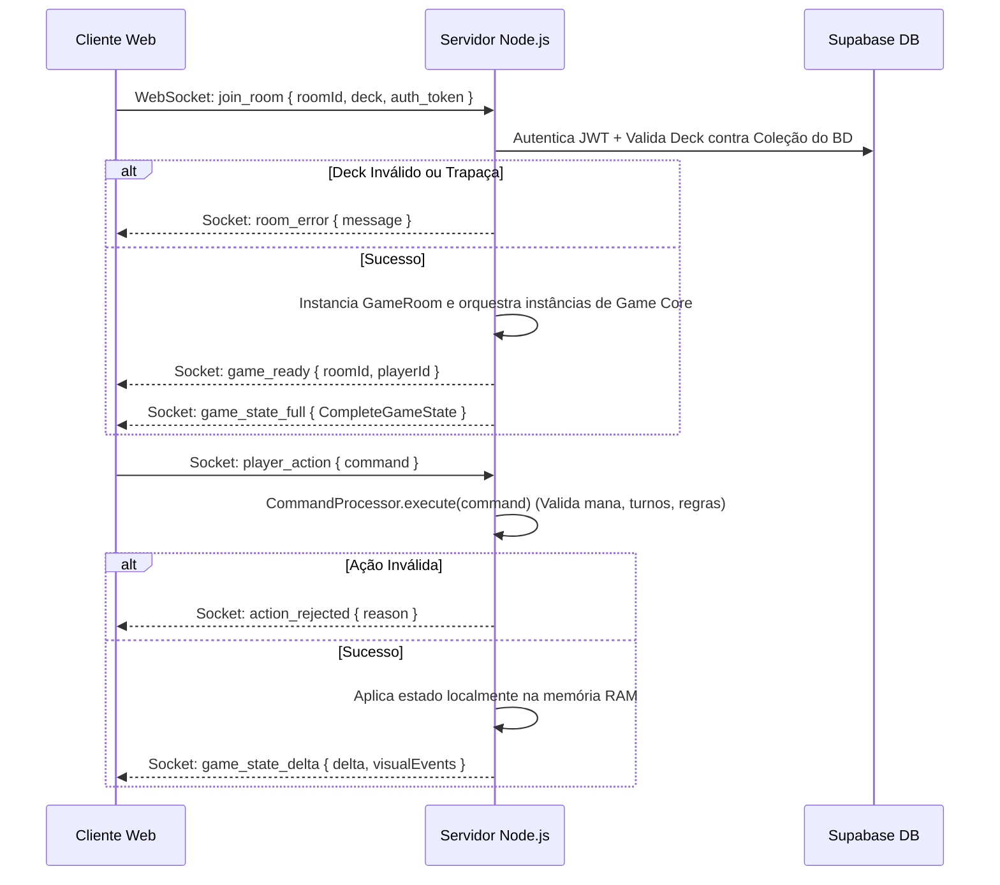

# Runeweave DCCG - Manual Arquitetural Core

Este documento é a Skill oficial e a única fonte de verdade arquitetural do **Runeweave DCCG**. Ele sintetiza todo o funcionamento do jogo, de ponta a ponta, servindo como uma "Super-Memória" para agentes de IA entenderem o projeto sem a necessidade de varredura profunda de múltiplos arquivos.

---

## 🗺️ Mapa de Diretórios e Estrutura do Projeto

```plaintext
/ (Raiz do Projeto)
├── .agent/                      # Configurações do Antigravity Kit (Agents, Skills, Workflows)
│   ├── ARCHITECTURE.md          # Arquitetura do framework de agentes
│   └── skills/                  # Skills do sistema
│       └── runeweave-dccg/      # Esta skill (sempre ativa)
│           └── SKILL.md         # Documento atual
├── assets/                      # Recursos visuais estáticos e dinâmicos do jogo
│   ├── dynamic/                 # Uploads dinâmicos de imagens (cartas administrativas)
│   └── images/
│       ├── cards/               # Imagens das cartas de facções
│       └── ui/                  # Logos, ícones, molduras e artefatos de UI
├── css/                         # Estilização visual (Vanilla CSS3 Pro, shaders, transições)
├── docs/                        # Documentações extras e rascunhos de design
├── js/                          # Camada de lógica do Cliente e Engine Core (Isomórfica)
│   ├── auth/                    # Fluxo de login e registro via Supabase Client
│   ├── core/                    # Engine Core Isomórfica (Segura, pura, roda em Node e Browser)
│   │   ├── ai/
│   │   │   └── AIPlayerAdapter.js # Bot IA que joga local/remotamente no backend
│   │   ├── effects/
│   │   │   ├── handlers/
│   │   │   │   └── effectHandlers.js # Handlers puros de efeitos individuais
│   │   │   └── EffectEngine.js  # Mecanismo de resolução de efeitos com Hexproof/Protection
│   │   ├── Battlefield.js       # Gerenciamento da zona de combate ativa de um jogador
│   │   ├── Card.js              # Classe base de dados de uma carta
│   │   ├── CardFactory.js       # Fábrica de instanciação dinâmica (Instants, Creatures, Runebindings)
│   │   ├── CombatManager.js     # Controle do fluxo de ataque/bloqueio
│   │   ├── CombatRules.js       # Regras e cálculos matemáticos de dano/atribuição
│   │   ├── CommandProcessor.js  # Processador de Ações (Command Pattern) c/ Cooldown e Segurança
│   │   ├── CreatureCard.js      # Lógica e modificadores dinâmicos de Criaturas
│   │   ├── Deck.js              # Gerenciador da pilha de compras do jogador
│   │   ├── EventBus.js          # Barramento de eventos desacoplado lógica <-> visualizer
│   │   ├── Game.js              # Instância Master da Engine (Estado Global do Combate)
│   │   ├── GameStateMachine.js  # FSM de estados globais (setup -> mulligan -> playing...)
│   │   ├── Glicko2Rating.js     # Algoritmo matemático para cálculo de MMR (Glicko-2)
│   │   ├── Graveyard.js         # Pilha de descarte dos jogadores
│   │   ├── Hand.js              # Gerenciador de cartas na mão
│   │   ├── InstantCard.js       # Lógica de mágicas instantâneas (efeitos rápidos)
│   │   ├── PersistenceManager.js # Persistência local fallback
│   │   ├── Player.js            # Lógica de vida, mana (Aether), limites e referências
│   │   ├── RankingManager.js    # Gerenciamento de MMR e classificação
│   │   ├── RunebindingCard.js   # Cartas de selamento anexáveis
│   │   ├── SetMasteryManager.js # Progressão de Nível e Coleção de Sets
│   │   ├── TriggerManager.js    # Processamento de gatilhos automáticos de turno/morte
│   │   ├── TurnManager.js       # Fases (Beginning, Combat, etc.) e sub-fases MTG-style
│   │   └── ZoneManager.js       # Integridade e movimentação de cartas entre zonas
│   ├── network/                 # Interface Socket.io no lado do cliente
│   │   ├── Matchmaking.js       # Sincronização com fila Supabase no cliente
│   │   ├── NetworkManager.js    # Cliente do Socket.io de batalha e deltas
│   │   └── ServerConfig.js      # URL dinâmicas do Servidor
│   ├── ui/                      # Visualizadores e manipuladores DOM do Cliente (jQuery)
│   │   ├── screens/             # Telas individuais (Lobby, DeckBuilder, Loja, Admin)
│   │   ├── CustomCursor.js      # Customização e renderização do ponteiro do mouse
│   │   ├── ScreenManager.js     # Roteador de telas SPA
│   │   └── UIManager.js         # Gerenciador visual do combate (Dumb Client - escuta deltas)
│   └── utils.js                 # Helpers auxiliares (uuid, math)
├── server/                      # Servidor Autoritativo Node.js (Ambiente Multiplayer)
│   ├── GameRoom.js              # Instanciação, reconexão, anti-cheat, deltas e gravação de partidas
│   ├── matchmaking.js           # Gerenciador de matchmaking rápido integrado ao banco
│   ├── redisClient.js           # Cliente Redis (sessões, cache, limiters rápidos)
│   ├── cacheService.js          # Abstração de cache distribuído
│   ├── supabaseClient.js        # Comunicação Servidor -> Banco de Dados via Service Role
│   └── server.js                # entry-point Fastify, APIs administrativas e Socket.io
├── supabase/                    # Scripts SQL executados no Supabase DB
│   ├── setup_users.sql          # Perfil, carteiras, triggers de signup, MMR inicial
│   └── setup_matchmaking.sql    # Tabelas de fila e histórico, realtime e RLS
├── package.json                 # Manifesto do projeto
├── render.yaml                  # Configuração de deploy Cloud (Render)
└── start_game.py                # Script Python orquestrador para inicialização local
```

---

## 🛠️ Tecnologias e Dependências do Ecossistema

### 1. Frontend Layer
* **HTML5 & CSS3 Pro:** Layout responsivo, animações avançadas de virada de cartas (tapping), filtros dinâmicos, glassmorphism e shaders visuais de desintegração.
* **JavaScript Vanilla (ES6+):** Programação puramente modular usando ES Modules no navegador.
* **jQuery:** Usado na camada de UI para manipulação eficiente do DOM e controle do fluxo SPA.
* **SortableJS:** Biblioteca de arrastar e soltar que alimenta o editor visual de decks (Deck Builder).

### 2. Backend Layer
* **Node.js (isomórfico):** Roda a exata mesma lógica da engine do jogo (`js/core/`) no backend, sem requerer reescrita.
* **Fastify:** Framework HTTP de alta performance (2x mais rápido que Express) com roteamento de baixo overhead e suporte integrado a JSON schemas.
* **Socket.io (WebSockets):** Comunicação duplex de tempo real com baixa latência para sincronização de inputs e estados de partidas.
* **Redis:** Usado em cache distribuído de cartas, itens da loja e sessões de matchmaking rápidos.

### 3. Database & Authentication
* **Supabase (PostgreSQL):** Banco de dados relacional que gerencia toda a persistência de contas de usuários, coleções, histórico de partidas e filas de matchmaking.
* **Supabase Auth:** Autenticação por e-mail/senha com JWT, sincronizada diretamente com os sockets via middleware.

---

## 🗄️ Esquemas do Banco de Dados (Supabase PostgreSQL)

O Supabase gerencia a consistência de dados do Runeweave através de três tabelas principais, protegidas por **Row Level Security (RLS)** e enriquecidas com triggers automatizados.

### 1. Tabela `public.users`
Guarda as contas dos jogadores, inventários, MMR e coleções de cartas. 
* **Estrutura SQL:**
```sql
CREATE TABLE public.users (
    id UUID PRIMARY KEY REFERENCES auth.users(id) ON DELETE CASCADE,
    username TEXT UNIQUE NOT NULL,
    is_admin BOOLEAN DEFAULT false,
    data JSONB DEFAULT '{}'::jsonb,
    created_at TIMESTAMPTZ DEFAULT NOW()
);
```
* **Esquema Interno do JSONB `data`:**
  * `wallet`: `{ gold: number, gems: number }`
  * `collection`: `string[]` (IDs das cartas adquiridas)
  * `decks`: `{ [deckId: string]: string[] }`
  * `stats`: `{ wins: number, losses: number }`
  * `rating`: `number` (MMR Glicko-2, inicializado em 1500)
  * `rd`: `number` (Desvio de Rating, inicializa em 350)
  * `volatility`: `number` (Volatilidade, inicializa em 0.06)
  * `rankTier`: `string` (Bronze, Silver, Gold, Platinum, Diamond, RuneMaster)
  * `rankDivision`: `number` (1 a 4)
  * `setMastery`: `{ [setId: string]: { xp: number, level: number } }`
  * `matchHistory`: Array de objetos `{ date, result, opponent, mmrChange }`
* **RLS Policies:**
  * **SELECT:** Aberto a todos (`USING (true)`) para que um jogador consiga ver o nome e o perfil do oponente.
  * **INSERT / UPDATE:** Permitido apenas se o ID autenticado for idêntico ao do registro (`auth.uid() = id`).

### 2. Tabela `public.matchmaking_queue`
Controla a fila de espera ativa para partidas multijogador em tempo real.
* **Estrutura SQL:**
```sql
CREATE TABLE public.matchmaking_queue (
    id UUID PRIMARY KEY DEFAULT gen_random_uuid(),
    user_id UUID NOT NULL REFERENCES auth.users(id) ON DELETE CASCADE,
    status TEXT NOT NULL DEFAULT 'waiting' CHECK (status IN ('waiting', 'matched', 'cancelled')),
    room_id TEXT, -- Preenchido pelo Servidor Node ao criar a sala
    created_at TIMESTAMPTZ DEFAULT NOW()
);
-- Garante que um usuário só tenha 1 registro esperando fila por vez
CREATE UNIQUE INDEX unique_active_user_in_queue ON public.matchmaking_queue (user_id) WHERE (status = 'waiting');
```
* **RLS Policies:**
  * **SELECT / INSERT / DELETE:** Permitidos apenas para o dono do registro (`auth.uid() = user_id`).
* **Realtime:** Habilitado explicitamente para esta tabela. O frontend ouve mudanças nesta tabela via subscrição em tempo real. Quando o `room_id` é preenchido pelo servidor Node.js, os dois clientes conectados entram na partida Socket.io correspondente.

### 3. Tabela `public.matches`
Registra o histórico e telemetria de todas as partidas de combate realizadas.
* **Estrutura SQL:**
```sql
CREATE TABLE public.matches (
    id UUID PRIMARY KEY DEFAULT gen_random_uuid(),
    player1_id UUID NOT NULL REFERENCES auth.users(id),
    player2_id UUID NOT NULL REFERENCES auth.users(id),
    winner_id UUID REFERENCES auth.users(id), -- NULL se empate
    match_data JSONB DEFAULT '{}'::jsonb, -- Armazena turnCount, duration, totalDamageDealt, etc.
    played_at TIMESTAMPTZ DEFAULT NOW()
);
```
* **RLS Policies:**
  * **SELECT:** Apenas se o usuário autenticado for um dos jogadores envolvidos (`auth.uid() = player1_id OR auth.uid() = player2_id`).

### 4. Trigger de Cadastro Automatizado
Ao efetuar signup via Supabase Auth, o trigger `on_auth_user_created` intercepta o evento e insere automaticamente a estrutura básica completa de carteira, maestria e MMR inicial na tabela `public.users` (`SECURITY DEFINER`), garantindo integridade imediata de novos usuários.

---

## 🤖 Arquitetura do Servidor Autoritativo (Multiplayer & Conexão)

O servidor do Runeweave funciona sob o padrão **Authoritative Server** (Servidor Autoritativo). O cliente web não toma decisões, não calcula dano e não altera estados locais diretamente. Ele é um **Dumb Client** (Cliente Burro).



### 1. Autenticação e Segurança (Socket Middleware)
Durante a conexão inicial WebSocket, o handshake passa por um middleware do Socket.io. Este middleware valida o token JWT enviado no Supabase Auth. Sockets inválidos ou sem token são desconectados imediatamente.
* **Anti-Cheat estrito no Join:** Antes de instanciar a partida, o servidor puxa a coleção real do usuário do Supabase e valida o deck submetido:
  1. O deck deve conter estritamente entre 30 e 60 cartas.
  2. Nenhuma carta pode ter mais de 4 cópias no deck.
  3. O jogador não pode conter cartas no deck que ele não possui em sua coleção `users.data.collection` no banco de dados. Qualquer divergência aborta a inicialização com erro.

### 2. Gerenciamento de Salas (`GameRoom`)
Cada partida PvP ou solo (contra IA) roda em isolamento em uma instância de `GameRoom`.
* **Fluxo Solo vs IA:** Ao invocar `join_solo`, o servidor instancia o `GameRoom`, monta a classe humana e associa uma IA virtual (`AIPlayerAdapter`) acoplada diretamente à engine local, processando as jogadas do bot na própria CPU do servidor.
* **Histórico de Logs e Chats:** O `GameRoom` consolida `logsHistory` e `chatHistory` em memória RAM, centralizando transmissões para espectadores conectados em salas do tipo `roomId_spectators`.

### 3. Delta-State Synchronization (Sincronização por Diferença)
Para otimizar o uso de banda de rede e evitar enviar dados massivos repetidamente, o servidor utiliza sincronização via deltas:
1. Após qualquer comando bem-sucedido executado no `Game.js`, o servidor serializa o novo estado.
2. O método `computeDelta(oldState, newState)` calcula as chaves que mudaram (como fases, vida, mana, posições específicas de cartas alteradas).
3. O servidor emite um evento `game_state_delta` apenas com as chaves modificadas e eventos visuais descartáveis (como animações de gatilho rúnico).
4. O frontend dumb simplesmente faz o merge desse delta e atualiza os elementos específicos do DOM.

### 4. Resiliência a Desconexões e F5 (State Recovery)
Se um jogador desconecta temporariamente (oscilação de rede ou refresh manual F5):
1. O servidor **não destrói a partida imediatamente**. Ele envia um alerta global para a sala e ativa um timer de tolerância de **40 segundos**.
2. Ao restabelecer a rede ou recarregar a aba, o cliente emite `rejoin_room`.
3. O método `reconnectPlayer` remapeia as referências do novo socketID para o ID do jogador persistente, cancela o timer de derrota e envia um pacote `game_state_full` contendo a árvore inteira de estado, logs passados acumulados e o histórico de chat. A tela do cliente é redesenhada perfeitamente.
4. Se o timer expirar sem reconexão, o oponente ganha automaticamente por desistência.

### 5. Algoritmo MMR (Glicko-2) e Progressão
Ao término da partida, o servidor roda a rotina autoritativa `saveMatchResult`:
* Grava o histórico de combate na tabela relacional `matches` do Supabase.
* Modifica o MMR Glicko-2 (`RankingManager.js`) com base na diferença de MMR entre os jogadores.
* Processa XP, progressão de passe e maestria de set (`SetMasteryManager.js`).
* Atualiza moedas, estatísticas de vitórias e grava os dados de volta via chave de serviço no Supabase, disparando o evento `match_rewards` com o sumário completo de recompensas.

---

## 🧠 Arquitetura do Motor de Jogo Core (Isomórfico)

A lógica central da engine de combate reside integralmente em `js/core/`. Ela foi desenvolvida sem acoplamento a APIs específicas do browser (como `window` ou `document`), permitindo ser importada tanto no servidor Node quanto no navegador dos jogadores.

### 1. Barramento de Eventos Desacoplado (`EventBus`)
Toda comunicação na lógica interna ocorre via emissões de eventos pelo `EventBus` personalizado do `Game.js`. A UI apenas escuta esses eventos para disparar animações e efeitos sonoros, garantindo isolamento total do modelo visual.

#### Dicionário de Eventos do EventBus (Referência de UI/UX)
Para facilitar integrações de áudio, partículas e renderização dinâmica, o frontend dumb escuta os seguintes eventos disparados pela Engine Core:
*   `gameStateChanged`: Notifica que o tabuleiro sofreu alguma alteração lógica estrutural, disparando a atualização parcial ou total da UI.
*   `gameLog`: Envia mensagens em formato `{ message: string, type: string }` para alimentação do chat/console de batalha.
*   `gameOver`: Disparado ao fim da partida contendo o payload `{ winnerId, loserId, totalDamageDealt, duration, turnCount }`.
*   `abilityActivated`: Emitido ao ativar uma habilidade de criatura, contendo `{ cardId, playerId }`.
*   `keywordTriggered`: Disparado para keywords especiais visuais (ex: `{ keyword: 'ward', targetId }` para animações de escudo/hexproof).
*   `showCardSelection`: Evoca o modal visual de seleção quando um efeito de olhar topo do deck é resolvido: `{ playerId, cards, pickCount, destination, sourceCardId }`.
*   `playerStatsChanged`: Avisa que atributos de status individuais mudaram rápidos, contendo `{ playerId, updates: { mana, life } }`.

### 2. State Machine Master (`GameStateMachine`)
O ciclo global de vida de uma partida é regulado por uma Máquina de Estados Finitos estrita:
```plaintext
[setup] ➔ [starting] ➔ [mulligan] ➔ [playing] ➔ [discarding] ➔ [game_over]
```
As transições são validadas e nenhuma ação de jogo (como jogar cartas) é processada fora do estado ativo correto.

### 3. Turn System MTG-Style (`TurnManager`)
A estrutura dos turnos segue o modelo de fases e subfases hierárquicas inspirado em Magic: The Gathering:

| Fase Principal (`phase`) | Sub-fase (`subPhase`) | Ação / Regra Automática |
| :--- | :--- | :--- |
| **Beginning** (Início) | `untap` (Desvirar) | Desvira todas as criaturas do jogador ativo automaticamente. |
| | `upkeep` (Manutenção) | Dispara triggers temporários e efeitos de início de turno. |
| | `draw` (Compra) | Compra 1 carta automática do deck. |
| **Main 1** | `main1` (Principal) | Permite jogar criaturas, instants, tramas rúnicas e forjar mana. |
| **Combat** (Combate) | `begin_combat` | Fase de preparação rápida para o combate. |
| | `declare_attackers` | Atacante declara criaturas atacantes (tapa/vira a carta). |
| | `declare_blockers` | Defensor designa bloqueadores para cada atacante. |
| | `combat_damage` | Resolução simultânea de dano físico e keywords (First Strike). |
| | `end_combat` | Conclusão das hostilidades do turno. |
| **Main 2** | `main2` (Principal) | Fase final de posicionamento e uso de mana residual. |
| **Ending** (Fim) | `end_step` | Gatilhos de fim de turno. |
| | `cleanup` (Limpeza) | Limpa buffs temporários expirados e reseta ferimentos. |

### 4. Catálogo de Comandos e Payloads (`CommandProcessor`)
Para emitir inputs via WebSockets, o cliente empacota as ações do jogador em uma estrutura padrão `{ type: string, playerId: string, payload: Object }` enviada sob a assinatura de `player_action`. Segue o catálogo de referências de payloads aceitos pelo servidor:

*   **`KEEP_HAND` / `MULLIGAN`:** 
    *   *Uso:* Confirmação ou descarte da mão inicial na fase de Mulligan.
    *   *Payload:* `{}` (Vazio).
*   **`PLAY_CARD`:** 
    *   *Uso:* Conjura uma criatura, instantâneo ou selamento.
    *   *Payload:* `{ cardUniqueId: string, targetId: string|null }`
*   **`DISCARD_FOR_MANA`:** 
    *   *Uso:* Descarta um card da mão na Fase de Mana para aumentar permanentemente o limite máximo em +1 (Discard-to-Forge).
    *   *Payload:* `{ cardUniqueId: string }`
*   **`DECLARE_ATTACKERS`:** 
    *   *Uso:* Declaração de criaturas na fase de combate.
    *   *Payload:* `{ attackerIds: string[] }` (IDs únicos das criaturas declaradas).
*   **`DECLARE_BLOCKERS`:** 
    *   *Uso:* Assignação de defensores para conter ataques.
    *   *Payload:* `{ assignments: Array<{ attackerId: string, blockerId: string }> }`
*   **`ACTIVATE_ABILITY`:** 
    *   *Uso:* Ativação de habilidades ativas em criaturas sob controle.
    *   *Payload:* `{ cardUniqueId: string, targetId: string|null }`
*   **`RESOLVE_SELECTION`:** 
    *   *Uso:* Confirmação de cartas escolhidas em efeitos de busca de topo ou tutorial.
    *   *Payload:* `{ selectedIds: string[], allLookedAtIds: string[], destination: 'hand'|'bottom'|'deck', sourceCardId: string }`
*   **`PASS_PHASE` / `PASS_PRIORITY` / `END_TURN`:** 
    *   *Uso:* Controle e avanço sequencial do fluxo de turnos.
    *   *Payload:* `{}` (Vazio).

---

## 🎨 Guia de Extensão: Como Criar Novos Cards e Efeitos

### 1. Como Criar Novos Cards (Estrutura JSON)
As cartas são definidas de forma data-driven em arquivos JSON organizados por facção em `js/data/cards/`. Para inserir um card na database do jogo, adicione-o com a seguinte estrutura padronizada:

#### Criatura (Creatures)
```json
{
  "id": "creature_shash_guard",
  "nome": "Guarda de Shash",
  "tipo": "Criatura",
  "Facção": "Círculo de Ashkar",
  "custo": 3,
  "ataque": 3,
  "defesa": 4,
  "tribo": "Guerreiro",
  "keywords": ["protection"],
  "habilidade": "Gatilho Rúnico: Ao entrar em campo, cause 2 de dano em um oponente.",
  "efeitos": [
    {
      "trigger": "on_enter",
      "type": "damage",
      "value": 2,
      "targetRequirement": "player_opponent"
    }
  ],
  "raridade": "Comum",
  "imagem_src": "assets/images/cards/shash_guard.png"
}
```

#### Selamentos (Runebindings)
```json
{
  "id": "runebinding_seal_fire",
  "nome": "Selo de Fogo Rúnico",
  "tipo": "Trama Rúnica",
  "Facção": "Círculo de Ashkar",
  "custo": 2,
  "habilidade": "Anexa a uma criatura. Ela recebe +2 de ataque e a keyword hexproof.",
  "efeitos": [
    {
      "trigger": "on_attached",
      "type": "buff",
      "attack": 2,
      "toughness": 0,
      "duration": -1,
      "targetRequirement": "creature"
    },
    {
      "trigger": "on_attached",
      "type": "status",
      "status": "hexproof",
      "duration": -1,
      "targetRequirement": "creature"
    }
  ],
  "raridade": "Rara",
  "imagem_src": "assets/images/cards/seal_fire.png"
}
```

### 2. Como Registrar um Novo Efeito no `EffectEngine`
Quando você cria uma mecânica com um `type` inédito no JSON da carta (ex: `"type": "discard_opponent"`), você **deve** criar o correspondente handler lógico puro na engine para que ela consiga resolvê-lo.

#### Passo 1: Escrever a função pura do handler em `js/core/effects/handlers/effectHandlers.js`
A assinatura obrigatória de qualquer handler é:
`(effectDef, caster, target, source, game) => boolean`
```javascript
/** Descarta X cartas aleatórias da mão do oponente. */
export function handleDiscardOpponent(effectDef, caster, target, source, game) {
    const opp = game.getOpponent(caster.id);
    if (!opp) return false;
    
    const value = parseInt(effectDef.value, 10) || 1;
    let discardedCount = 0;
    
    for (let i = 0; i < value; i++) {
        const discarded = opp.hand.removeRandomCard();
        if (discarded) {
            game.moveCardToZone(discarded.uniqueId, opp.id, 'hand', 'graveyard');
            discardedCount++;
        }
    }
    
    if (discardedCount > 0) {
        game.emitEvent('gameLog', { 
            message: `${opp.name} foi forçado a descartar ${discardedCount} carta(s) por ${source.name}.` 
        });
        return true;
    }
    return false;
}
```

#### Passo 2: Registrar o Handler na função `registerAllHandlers` do mesmo arquivo
Associe o tipo de efeito (definido no JSON) à função Javascript criada:
```javascript
export function registerAllHandlers(engine) {
    // ... Handlers existentes ...
    engine.register('discard_opponent', handleDiscardOpponent);
}
```

---

## ⚡ Conhecimentos de Debugging e Gotchas (Armadilhas Comuns)

Ao trabalhar na correção de bugs ou otimização do Runeweave, mantenha estes pontos críticos sob extrema atenção:

### 1. Cooldown de Fases (`PASS_PHASE` & `END_TURN`)
* **O Problema:** Os botões de avançar turno/fase da UI podiam ser pressionados em rajadas rápidas pelo usuário (double click), fazendo com que múltiplos pacotes fossem enviados e pulando o turno do próprio jogador sem que ele pudesse agir.
* **A Solução (Gotcha Arquitetural):** O `CommandProcessor.js` implementa um limitador interno de cooldown. Comandos rápidos de alteração de fase emitidos pelo mesmo jogador em menos de **800ms** são sumariamente **rejeitados** pelo processador de comandos do servidor. *(Nota: Esse limite é ignorado em testes de automação de suites e pela Inteligência Artificial).*

### 2. Fluxo e Bloqueios do Combate
* **Oponente Agindo Fora do Turno:** Lembre-se de que a subfase `declare_blockers` é a única parte do combate onde o jogador ativo **não tem controle de prioridade primária**. As chamadas de ação da UI bloqueadora devem vir do ID do oponente defensor, validado de forma especial no `CommandProcessor.#isValidPlayerForAction`.

### 3. Hexproof e Proteção de Alvo
* O motor `EffectEngine.js` valida no método `#resolveTarget` se uma criatura possui `hexproof`, `protection` ou status `shroud`. Se ela possuir, e for alvo de um efeito de carta cujo conjurador (`caster.id`) é o oponente (`ownerId !== caster.id`), a resolução aborta e um evento visual `keywordTriggered (ward)` é disparado. Lembre-se disso ao testar remoções diretas.

### 4. Mapeamento de Sockets Reais
* O servidor Node rastreia conexões mapeando o ID interno do Supabase com o WebSocket ativo. No login ou join, o cliente **obrigatoriamente** emite o evento `register_user` contendo `{ userId }`. Sem esse registro, reconexões subsequentes (F5) não conseguirão encontrar a sala de combate antiga na memória RAM, já que o ID antigo associado falhará na correspondência.

---

## 💻 Fluxo de Trabalho Local e Comandos de Verificação

Para agilizar o desenvolvimento local e auditorias de código feitas por agentes IAs, utilize o seguinte catálogo de comandos:

### 1. Inicialização do Ambiente
*   **Inicializador Orquestrado de 1 Clique (Windows):** Execute o arquivo em lote na raiz:
    ```powershell
    .\start_game.bat
    ```
*   **Inicializador Manual via Python (Seguro em todos os SOs):**
    ```bash
    python start_game.py
    ```
    *Este script dispara de forma assíncrona o servidor Fastify/Socket.io na porta 3000 e abre o servidor estático HTTP local.*

### 2. Execução da Suite de Testes (Jest)
Antes de qualquer alteração na lógica core de regras ou managers, execute a suite de testes isomórfica para prevenir regressões:
```bash
npm test
```

### 3. Scripts de Checklist do Antigravity Kit
Para rodar auditorias rápidas de UX, segurança, código e acessibilidade utilizando o framework de agentes:
```bash
# Executa checagem de qualidade, segurança e linter local
python .agent/scripts/checklist.py .

# Executa checagem completa pré-deploy (incluindo E2E, Lighthouse e Mobile Audit)
python .agent/scripts/verify_all.py . --url http://localhost:3000
```
